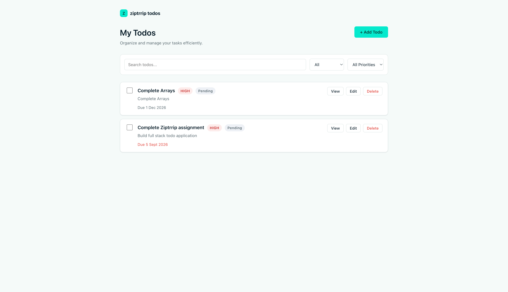
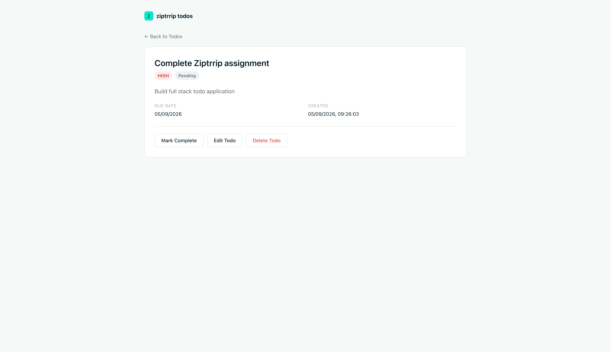

# Ziptrrip Todo Application

## Overview

A full-stack Todo application built as a technical assignment for Ziptrrip. It provides complete task management (create, view, edit, delete, complete/pending toggling) along with search and filtering, backed by a REST API and a PostgreSQL database via Prisma. The frontend is implemented as a true Multiple Page Application (MPA) using two separate Vite/React entry points rather than a single-page client-side router.

## Application Screenshots

### Todo List Page



### Todo Details Page



## Features

- **Create Todo** — add a new todo with title, description, priority, and due date
- **View Todos** — list all todos on the Todo List page
- **View Single Todo** — dedicated details page for one todo, addressed by `?id=`
- **Edit Todo** — update an existing todo's fields (title, description, priority, due date, completion status)
- **Delete Todo** — remove a todo with a confirmation prompt
- **Mark Complete / Pending** — toggle a todo's completion state from the list, the checkbox, or the details page
- **Search Todos** — case-insensitive search across title and description, debounced client-side
- **Filter by Status** — All / Pending / Completed
- **Filter by Priority** — All Priorities / LOW / MEDIUM / HIGH
- **Due Date** — optional due date shown on cards and the details page, with overdue highlighting
- **Priority** — LOW / MEDIUM / HIGH, shown as a badge everywhere a todo is displayed

## Tech Stack

**Frontend**
- React 19
- TypeScript
- Vite (configured as a Multiple Page Application)
- Axios (API client)
- Plain CSS (no UI framework)

**Backend**
- Express 5
- Prisma ORM 7 (with the `@prisma/adapter-pg` driver adapter)
- Zod (request validation)
- PostgreSQL (hosted on Supabase)

### Multiple Page Application (MPA)

The frontend does **not** use React Router. Instead, Vite is configured with two independent HTML entry points, each bootstrapping its own React root:

- `index.html` → Todo List page (`src/main.tsx` → `TodosPage`)
- `todo.html?id=<todo-id>` → Todo Details page (`src/todo-main.tsx` → `TodoDetailsPage`, reads the id from the query string via `URLSearchParams`)

Navigating between the two pages is a real browser navigation (`window.location.href`), not client-side routing.

## Project Structure

```
ziptrrip-todo-assignment/
├── postman/
│   └── Ziptrrip-Todo-API.postman_collection.json
├── client/
│   ├── index.html                  # Todo List entry HTML
│   ├── todo.html                   # Todo Details entry HTML
│   ├── vite.config.ts              # MPA rollup input configuration
│   └── src/
│       ├── main.tsx                # React root for index.html
│       ├── todo-main.tsx           # React root for todo.html
│       ├── pages/
│       │   ├── TodosPage.tsx
│       │   └── TodoDetailsPage.tsx
│       ├── components/
│       │   ├── TodoForm.tsx        # Shared create/edit form
│       │   └── PriorityBadge.tsx
│       ├── services/
│       │   └── todoApi.ts          # Axios client for the backend API
│       ├── types/
│       │   └── todo.ts
│       └── styles/
│           ├── index.css
│           ├── layout.css
│           ├── todo.css
│           └── form.css
└── server/
    ├── prisma/
    │   ├── schema.prisma            # Todo model + Priority enum
    │   └── migrations/
    └── src/
        ├── server.ts                 # App entry point
        ├── app.ts                    # Express app, middleware, routes
        ├── routes/
        │   └── todo.routes.ts
        ├── controllers/
        │   └── todo.controller.ts
        ├── services/
        │   └── todo.services.ts      # Prisma queries
        ├── schemas/
        │   └── todo.schema.ts        # Zod validation schemas
        ├── middleware/
        │   ├── validate.middleware.ts
        │   └── error.middleware.ts
        └── lib/
            └── prisma.ts             # Prisma client + pg driver adapter
```

## Prerequisites

- Node.js (v20 or later recommended)
- npm
- A PostgreSQL database connection string (a free [Supabase](https://supabase.com) project works well)

## Installation

**1. Clone the repository**

```bash
git clone <repository-url>
cd ziptrrip-todo-assignment
```

**2. Install server dependencies**

```bash
cd server
npm install
```

**3. Configure environment variables**

Create a `.env` file inside `server/` (see [Environment Variables](#environment-variables) below).

**4. Install client dependencies**

```bash
cd ../client
npm install
```

**5. Run Prisma migrations**

From the `server/` directory:

```bash
cd ../server
npx prisma migrate dev
```

This applies the existing migration (`prisma/migrations/20260904145003_init`) and generates the Prisma Client into `server/generated/prisma`.

**6. Start the backend**

From `server/`:

```bash
npm run dev
```

**7. Start the frontend**

From `client/` (in a separate terminal):

```bash
npm run dev
```

## Environment Variables

Set these in `server/.env`:

```
DATABASE_URL="your_database_connection_string"
```

Optional:

```
PORT=3000
```

`PORT` defaults to `3000` if not set (see `server/src/server.ts`). No `.env` file is required on the `client/` side — the API base URL is currently set directly in `client/src/services/todoApi.ts`.

## Running the Application

- **Frontend:** http://localhost:5173
- **Backend:** http://localhost:3000
- **Health check:** http://localhost:3000/health
- **API base path:** http://localhost:3000/api/todos

## API Documentation

See `API.md` for detailed endpoint documentation (request/response shapes, validation rules, and status codes). In the meantime, the Postman collection below fully documents every endpoint and can be explored directly.

## Postman Collection

A ready-to-import Postman collection is available at:

```
postman/Ziptrrip-Todo-API.postman_collection.json
```

It includes all six Todo endpoints (Create, Get All, Get Single, Update, Toggle, Delete) with example request bodies, example query parameters (`search`, `status`, `priority`, `page`, `limit`), and a `baseUrl` collection variable defaulting to `http://localhost:3000`.

To use it: open Postman → Import → select the file → set the `todoId` collection variable to an existing todo's id before running ID-based requests.

## Tests

No automated test suite has been implemented yet. The `server` package defines a placeholder script:

```bash
npm test
```

which currently exits with an error (`"Error: no test specified"`). The `client` package does not define a `test` script; `npm run lint` is available to run ESLint.

## Architecture

```
React + Vite MPA
        ↓
Express API
        ↓
Prisma ORM
        ↓
Supabase PostgreSQL
```

The React frontend calls the Express REST API over HTTP (via Axios), Express delegates data access to Prisma, and Prisma communicates with the PostgreSQL database (hosted on Supabase) through the `@prisma/adapter-pg` driver adapter.

## Design Decisions

1. **TypeScript** — used across both frontend and backend to catch integration errors (e.g. mismatched request/response shapes) at compile time rather than at runtime, and to keep the Prisma-generated types flowing end-to-end through services, controllers, and the API client.

2. **Prisma** — chosen for its type-safe query builder generated directly from the schema, its built-in migration workflow, and its straightforward integration with PostgreSQL via the `@prisma/adapter-pg` driver adapter.

3. **PostgreSQL / Supabase** — PostgreSQL provides a mature, relational database well suited to a structured Todo model; Supabase was used as a free, quickly provisioned managed Postgres host, avoiding the need to run a local database server.

4. **MPA implementation** — the assignment explicitly required a Multiple Page Application rather than a single-page app. This was implemented using Vite's native support for multiple HTML entry points (`vite.config.ts` → `build.rollupOptions.input`), with `index.html` and `todo.html` each mounting an independent React root (`main.tsx` and `todo-main.tsx`). The todo id is passed via a real query parameter (`todo.html?id=<todo-id>`) and read with `URLSearchParams`.

5. **No React Router** — since the two pages are genuinely separate HTML documents served by Vite (not client-side routes within one document), introducing React Router was unnecessary and would have blurred the distinction between "MPA" and "SPA with routing." Navigation between pages uses plain `window.location.href` browser navigation instead.
